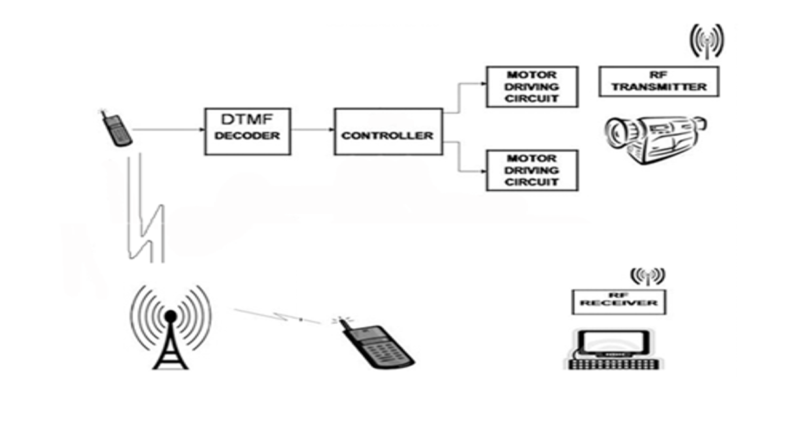

# Dual Tone Multi-Frequency Based Robotic Vehicle

## Introduction

Inspired by the functionality of automated voice call systems, this project involves the development of a robotic vehicle capable of interpreting Dual Tone Multi-Frequency (DTMF) tones as input. Through the decoding of DTMF tones into digital formats and subsequent processing by Arduino, the robot's movements are controlled. This undertaking required proficiency in C programming, Arduino, DTMF decoding, circuit design, and motor control, resulting in a pioneering application of technology within automated control systems.

In practical terms, the robot is operated through a mobile phone that initiates a call to another mobile device attached to the robot. Utilizing a Dial Tone Pad based on DTMF technology, signals are transmitted. Each button press on the mobile phone generates a corresponding tone heard at the receiving end of the call.

## Block Diagram

## Assemble the Circuit

To assemble the circuit, refer to the connections outlined in the `layout.png` file provided. This visual guide illustrates the required connections for successful implementation.

## Load the Code

Upload the code found in the `arduino-sketch.ino` file onto your Arduino board to enable the robot's functionality.

